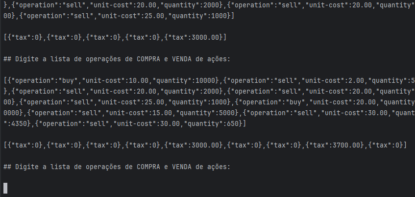

# Calculos de Impostos

Basicamente, a aplicação processa o JSON com as entradas que representam operações de compra ou venda na bolsa de valores e loga, para cada operação, se ela gera ou não imposto.

Segue abaixo um print da aplicação sendo executada.



## Tecnologias utilizadas

Principais tecnologias utilizadas no projeto são:

- **Java 17**
- **Maven**
- **Lombok**
- **jUnit5**
- **assertJ**
- **Mockito**
- **Jackson**

Procurei seguir na estruturação código um pouco de Arquitetura Hexagonal e DDD.

Boa parte da aplicação foi desenvolvida com TDD, utilizando os cases fornecidos para criar os testes antes de iniciar a implementação da aplicação.

## Como rodar

Para rodar a aplicação, é necessário ter `Java 17` e `Maven` instalado.

Executar os seguintes comandos no bash:

```bash
## compilar o código
mvn clean install

## executar a aplicação
java -jar target/*.jar
```

Com mvn install será compilada a aplicação e executados os testes de unidade da mesma. Não utilizei ferramentas extras de cobertura de codigo como o jacoco.

Desenvolvi a aplicação com Intellij, então ela pode ser executada no mesmo ou com outra IDE de preferência, sem precisar ser direto no terminal.

Depois de iniciar a aplicação, é necessário inserir as entradas em apenas uma linha para que a aplicação rode corretamente. Mais abaixo nessa documentação já tem os cases formatados em apenas uma linha.

Decidi por não cobrir 80% dos testes de unidade. Fiz testes para as principais funcionalidades. Mas seria mais uma questão de reservar mais um tempo para aumentar a cobertura e garantir mais cenários.

## Mais alguns detalhes

Principais modelos e usecases da aplicação:

- `CalculationInput`: DTO para receber a lista de Operações de VENDA/COMPRA do terminal
- `CalculationOutput`: DTO para imprimir o resultado das taxas das Operações
- `OperationEvent`: Modelo utilizado para receber as informações do terminal e armazenar o processamento deles. Informações como **imposto a ser pago**, **quantidade atual de ações**, **saldo** (zerado, lucro ou prejuizo) e **compras anteriores de ações** são salvas nesse modelo para armazenar a informação atual e para ser utilizada nos proximos processamentos de Operação.
- `TaxCalculatorOrchestrationUseCase`: Orquestrador que converte o input para o modelo `OperationEvent`, chama os usecases responsáveis conforme o tipo de operação (VENDA ou COMPRA) e converte o resultado para o DTO de output. Adicionei um terminário para decidir qual usecase chamar, mas poderia ter sido uma lista e um tipo de processamento mais strategy, mas deixei simples mesmo. Usei .reduce() para ir processando e incrementando os eventos.
- `SellCalculatorUseCase` e `BuyCalculatorUseCase`: UseCases que possuem as logicas especificas para cada tipo de Operação. Extendem o `CalculatorUseCaseAbstract` que usa Template Method no metodo `process()`;

Utilizei um validador bem simples para validar os campos de entrada.

## Cases

Segue abaixo alguns inputs de cases para calculo:

### Case 1 

Entrada:

```json
[{"operation":"buy","unit-cost":10.00,"quantity":100},{"operation":"sell","unit-cost":15.00,"quantity":50},{"operation":"sell","unit-cost":15.00,"quantity":50}]
```

### Case 2

Entrada:

```json
[{"operation":"buy","unit-cost":10.00,"quantity":10000},{"operation":"sell","unit-cost":20.00,"quantity":5000},{"operation":"sell","unit-cost":5.00,"quantity":5000}]
```

### Case 3

Entrada:

```json
[{"operation":"buy","unit-cost":10.00,"quantity":10000},{"operation":"sell","unit-cost":5.00,"quantity":5000},{"operation":"sell","unit-cost":20.00,"quantity":3000}]
```
### Case 4

Entrada:

```json
[{"operation":"buy","unit-cost":10.00,"quantity":10000},{"operation":"buy","unit-cost":25.00,"quantity":5000},{"operation":"sell","unit-cost":15.00,"quantity":10000}]
```

### Case 5

Entrada:

```json
[{"operation":"buy","unit-cost":10.00,"quantity":10000},{"operation":"buy","unit-cost":25.00,"quantity":5000},{"operation":"sell","unit-cost":15.00,"quantity":10000},{"operation":"sell","unit-cost":25.00,"quantity":5000}]
```

### Case 6

Entrada:

```json
[{"operation":"buy","unit-cost":10.00,"quantity":10000},{"operation":"sell","unit-cost":2.00,"quantity":5000},{"operation":"sell","unit-cost":20.00,"quantity":2000},{"operation":"sell","unit-cost":20.00,"quantity":2000},{"operation":"sell","unit-cost":25.00,"quantity":1000}]
```

### Case 7

Entrada:

```json
[{"operation":"buy","unit-cost":10.00,"quantity":10000},{"operation":"sell","unit-cost":2.00,"quantity":5000},{"operation":"sell","unit-cost":20.00,"quantity":2000},{"operation":"sell","unit-cost":20.00,"quantity":2000},{"operation":"sell","unit-cost":25.00,"quantity":1000},{"operation":"buy","unit-cost":20.00,"quantity":10000},{"operation":"sell","unit-cost":15.00,"quantity":5000},{"operation":"sell","unit-cost":30.00,"quantity":4350},{"operation":"sell","unit-cost":30.00,"quantity":650}]
```

### Case 8

Entrada:

```json
[{"operation":"buy","unit-cost":10.00,"quantity":10000},{"operation":"sell","unit-cost":50.00,"quantity":10000},{"operation":"buy","unit-cost":20.00,"quantity":10000},{"operation":"sell","unit-cost":50.00,"quantity":10000}]
```

### Case 9

Entrada:

```json
[{"operation":"buy","unit-cost":5000.00,"quantity":10},{"operation":"sell","unit-cost":4000.00,"quantity":5},{"operation":"buy","unit-cost":15000.00,"quantity":5},{"operation":"buy","unit-cost":4000.00,"quantity":2},{"operation":"buy","unit-cost":23000.00,"quantity":2},{"operation":"sell","unit-cost":20000.00,"quantity":1},{"operation":"sell","unit-cost":12000.00,"quantity":10},{"operation":"sell","unit-cost":15000.00,"quantity":3}]
```


